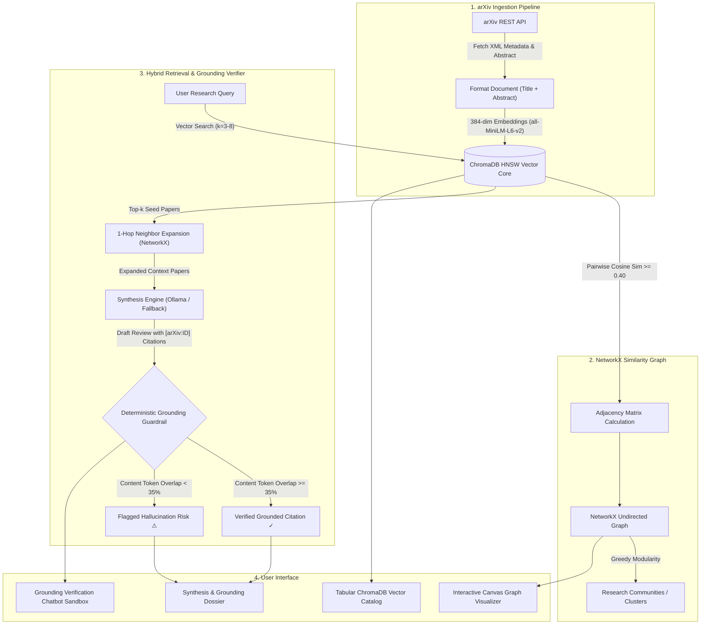
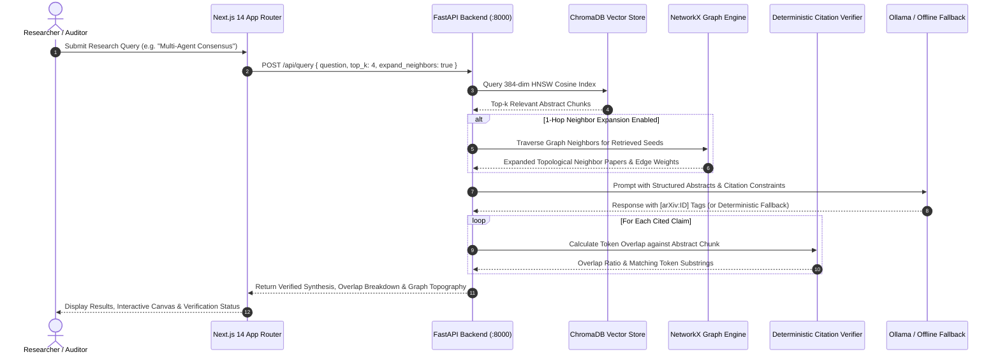

# PaperPulse AI: Academic Research Assistant & Citation Grounding Engine

[](LICENSE)
[](https://nextjs.org/)
[](https://fastapi.tiangolo.com/)
[](https://www.trychroma.com/)
[](https://networkx.org/)
[]()

> **PaperPulse AI** is a local literature review and citation grounding assistant. It ingests scientific papers directly from the arXiv API, indexes 384-dimensional dense vector embeddings into a local **ChromaDB** HNSW vector store, models inter-paper relationships using a **NetworkX** similarity graph, and verifies synthesized statements against cited abstracts using a **Deterministic Token-Level Grounding Guardrail** ($\ge 35\%$ overlap threshold) to flag unsupported claims.

---

## ⚠️ Restricted License & Non-Commercial Notice

> [!IMPORTANT]
> **RESTRICTED NON-COMMERCIAL USE — INTERVIEWER & EVALUATOR REVIEW ONLY**
> 
> This repository and its underlying source code, system architectures, database schemas, and verification algorithms are provided **strictly for review, inspection, and technical audit by interviewers, hiring managers, and academic evaluators**.
> 
> - **Commercial usage, commercial redistribution, SaaS hosting, or monetization of any part of this software is strictly prohibited.**
> - **Automated scraping, bulk ingestion, or unauthorized republication of the embedded assets or architecture is disallowed.**
> - All rights reserved by Sanidhya Agrawal.

---

## 1. Problem Statement

Standard Retrieval-Augmented Generation (Naive RAG) systems exhibit three recurring issues when used for academic and scientific synthesis:

1. **Hallucination & Citation Drift**: Generative language models can fabricate convincing citation markers (`[arXiv:...]`), attribute findings to the wrong paper, or extrapolate beyond the empirical findings reported in the source text.
2. **Context Fragmentation & Multi-Hop Blindspots**: Pure top-$k$ cosine vector retrieval treats documents as isolated points. Relevant papers that use slightly different phrasing or address complementary sides of an algorithm can be missed by direct semantic search alone.
3. **Stochastic Verification**: Most generative assistants rely on an LLM to evaluate another LLM's output. Without an external, deterministic auditing step, there is no mathematical verification of whether a cited claim is backed by the retrieved text.

---

## 2. System Architecture

PaperPulse AI addresses these problems by combining **Dense Vector Retrieval**, **Graph Topology Traversal**, and a **Deterministic Token-Level Grounding Guardrail**:



---

## 3. Core Technical Subsystems & Defensibility

### A. Deterministic Token-Level Grounding Guardrail
The verification logic (`services/citation_verifier.py`) audits every synthesized claim that contains an `[arXiv:ID]` tag against the corresponding stored abstract chunk without relying on another model call:

1. **Citation Extraction**: Identifies all citation tags matching regex pattern `r'\[arXiv:([0-9]{4}\.[0-9]{4,5}|[a-zA-Z\-]+/[0-9]{7}|[0-9]{7})\]'`.
2. **Claim Tokenization & Filtering**:
   - Strips citation tags and lowercases the sentence.
   - Cleans punctuation characters: `.,():;"`'[]{}?!`.
   - Filters out a fixed list of 39 English stopwords (e.g. *the, a, is, in, of, and, with, this, that*).
   - Excludes tokens $\le 3$ characters in length to retain only substantive terms (**content tokens**).
3. **Source Chunk Tokenization**:
   - Lowercases the retrieved paper's title and abstract.
   - Strips punctuation and removes the same stopword set.
4. **Precision Overlap Calculation**:
   $$\text{Overlap Ratio } R = \frac{|T_{\text{claim}} \cap T_{\text{chunk}}|}{|T_{\text{claim}}|}$$
5. **Deterministic Threshold Gate**:
   - If $R \ge 0.35$ (35%), the claim is marked **verified grounded**.
   - If $R < 0.35$, the claim is flagged as an **unsupported / hallucination risk**.
   - If the claim contains no heavy content words (e.g. short transitional sentences), it passes with $R = 1.0$.

### B. NetworkX Topological 1-Hop Neighbor Expansion
Standard dense retrieval queries can miss complementary literature when the query vocabulary does not align with the paper's specific terminology. The graph engine (`services/graph_service.py`) mitigates this:

1. **Graph Construction**: Extracts all stored embeddings from ChromaDB, normalizes them to unit vectors ($L_2$ norm), and calculates the pairwise cosine similarity matrix:
   $$S_{ij} = \frac{\mathbf{u}_i \cdot \mathbf{u}_j}{\|\mathbf{u}_i\|_2 \|\mathbf{u}_j\|_2}$$
2. **Thresholded Adjacency**: Adds an undirected edge between Paper $i$ and Paper $j$ if $S_{ij} \ge 0.40$.
3. **Neighbor Traversal**: When top-$k$ direct vector matches are retrieved from ChromaDB, the engine checks their graph neighbors in NetworkX, sorts them descending by edge weight (similarity), and injects up to 2 high-similarity neighbors per seed paper into the synthesis context.
4. **Community Partitioning**: Runs Clauset-Newman-Moore greedy modularity maximization (`nx.community.greedy_modularity_communities`) to assign papers into coherent research clusters.

### C. Three-Tier Synthesis Architecture & Offline Fallback
The synthesis orchestrator (`services/rag_service.py`) handles model connectivity gracefully:

- **Tier 1 (Local Ollama)**: Queries a locally hosted model (`qwen2.5-coder:3b` or `1.5b`) over HTTP at `http://127.0.0.1:11434/api/generate` with strict grounding instructions and low temperature (0.2).
- **Tier 2 (OpenRouter API)**: If Ollama is unreachable and an `OPENROUTER_API_KEY` is provided, requests completion from OpenRouter.
- **Tier 3 (Deterministic Template Fallback)**: If no LLM endpoint is reachable, the engine constructs a structured synthesis by extracting core lead sentences directly from the retrieved abstracts and formatting them with exact citations. This guarantees that the application runs locally, offline, and without failure even when Ollama is not running.

---

## 4. End-to-End Data Flow Sequence



---

## 5. Technology Stack

### Backend
- **Framework**: [FastAPI 0.110](https://fastapi.tiangolo.com/) (Asynchronous Python API with Pydantic v2 schemas)
- **Vector Database**: [ChromaDB](https://www.trychroma.com/) (Local persistent HNSW index with cosine distance)
- **Embedding Model**: `sentence-transformers` (`all-MiniLM-L6-v2`, 384-dimensional dense vectors)
- **Graph Topology**: [NetworkX 3.2](https://networkx.org/) (Cosine similarity graph, adjacency matrices, community detection)
- **Inference**: [Ollama](https://ollama.com/) local models (`qwen2.5-coder:3b` / `1.5b`) with deterministic sentence-extraction fallback
- **Server**: Uvicorn ASGI server

### Frontend
- **Framework**: [Next.js 14.2](https://nextjs.org/) (React 18, App Router, TypeScript)
- **Styling**: Tailwind CSS 3.4
- **Visualization**: Custom HTML5 Canvas engine with pre-rendered offscreen particle sprites and soft elliptical collision physics
- **Icons**: Lucide React

---

## 6. Directory Structure

```
paperpulse-ai/
├── backend/
│   ├── main.py                     # FastAPI application routes & endpoints
│   ├── config.py                   # Environment settings & retrieval thresholds
│   ├── services/
│   │   ├── arxiv_service.py        # arXiv REST API ingestion & XML parsing
│   │   ├── vector_store.py         # ChromaDB 384-dim HNSW vector core management
│   │   ├── graph_service.py        # NetworkX similarity graph & neighbor expansion
│   │   ├── citation_verifier.py    # Deterministic token-level overlap guardrail
│   │   └── rag_service.py          # Synthesis orchestration & offline fallback
│   ├── models/
│   │   └── schemas.py              # Pydantic request/response models
│   ├── tests/                      # Pytest unit & integration test suites
│   ├── requirements.txt            # Python dependencies
│   └── Dockerfile                  # Backend container configuration
├── frontend/
│   ├── app/
│   │   ├── layout.tsx              # Root HTML layout & metadata
│   │   ├── page.tsx                # Main dashboard container & tab navigation
│   │   └── globals.css             # Tailwind style imports
│   ├── components/
│   │   ├── StatsHeader.tsx         # Telemetry header & system status
│   │   ├── SearchBar.tsx           # Search input bar & arXiv ingestion modal
│   │   ├── CitationGraph.tsx       # HTML5 Canvas graph visualizer & box classifier
│   │   ├── AnswerCard.tsx          # Synthesis dossier & factual overlap breakdown
│   │   ├── VerificationChatbot.tsx # Interactive grounding verification sandbox
│   │   └── EvidenceDrawer.tsx      # Slide-over source paper & token inspector
│   ├── public/
│   │   └── logo.png                # Application logo
│   ├── tailwind.config.js          # Tailwind theme & color definitions
│   └── package.json                # Frontend dependencies & npm scripts
├── screenshots/                    # UI verification screen captures
├── LICENSE                         # Non-commercial evaluator license
└── README.md                       # Architecture & documentation
```

---

## 7. Local Setup & Installation

### Prerequisites
- **Python**: 3.10+
- **Node.js**: v18.17+ or v20+
- **Git**
- *(Optional)*: [Ollama](https://ollama.com/) running locally with `qwen2.5-coder:3b` (`ollama run qwen2.5-coder:3b`). If Ollama is not installed or running, the system automatically uses its deterministic offline synthesis fallback.

---

### Step 1: Clone the Repository

```bash
git clone https://github.com/sanidhyaagrawal17/paperpulse-ai.git
cd paperpulse-ai
```

---

### Step 2: Backend Setup (FastAPI & ChromaDB)

```bash
cd backend

# Create and activate Python virtual environment
python -m venv .venv

# On Windows (PowerShell):
.\.venv\Scripts\Activate.ps1
# On Linux/macOS:
source .venv/bin/activate

# Install dependencies
pip install -r requirements.txt

# Start FastAPI server on port 8000
python -m uvicorn main:app --host 127.0.0.1 --port 8000 --reload
```

Verify backend health at `http://127.0.0.1:8000/api/health`.

---

### Step 3: Frontend Setup (Next.js 14)

Open a separate terminal:

```bash
cd paperpulse-ai/frontend

# Install dependencies
npm install

# Build the production application
npm run build

# Start the application on port 3000
npm run start
# Or for live hot-reload development:
npm run dev
```

Open your browser at **`http://localhost:3000`**.

---

## 8. Dashboard Views

The application provides four dedicated tabs:

1. **Vector Store Catalog (`catalog`)**: Tabular list of indexed arXiv vectors with search filtering, domain categorization (*Multi-Agent*, *GraphRAG*, *Dense Vectors*, *Context*), abstract inspection, and direct links to arXiv PDFs.
2. **Visual Embedding Map (`topology`)**: Interactive HTML5 Canvas showing topological similarity relationships:
   - **Physics ON**: Dynamic force-directed layout with soft magnetic repulsion and particle pulses along similarity edges.
   - **Classified Boxes (Physics OFF)**: Cards ease into 4 categorized domain columns, smoothly returning to constellation positions when physics is re-enabled.
3. **Synthesis & Grounding Dossier (`matrix`)**: Synthesized literature review with interactive `[arXiv:ID]` badges, individual citation verification status, and an overlap spectrum bar.
4. **Grounding Verification Chatbot (`sandbox`)**: Interactive sandbox for testing arbitrary claims against indexed papers, adjusting the overlap threshold ($20\% - 60\%$), and highlighting matching token substrings.

---

## 9. Non-Commercial Academic Review License

```
Copyright (c) 2026 Sanidhya Agrawal. All Rights Reserved.

THIS SOFTWARE IS PROVIDED STRICTLY FOR TECHNICAL EVALUATION AND INTERVIEWER
REVIEW PURPOSES. PERMISSION IS EXPRESSLY DENIED TO COPY, MODIFY, MERGE, PUBLISH,
DISTRIBUTE, SUBLICENSE, OR SELL COPIES OF THE SOFTWARE FOR COMMERCIAL PURPOSES.
```
