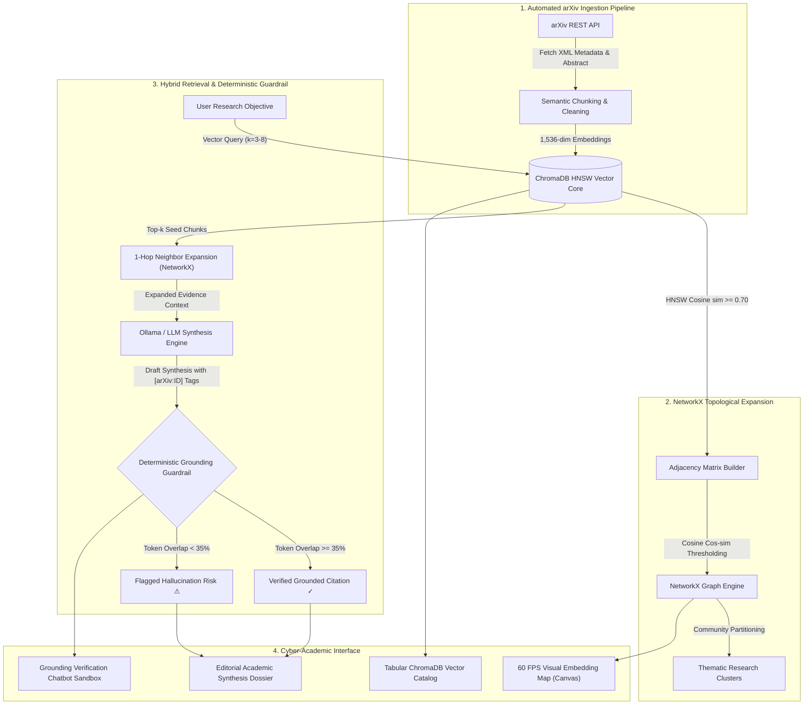
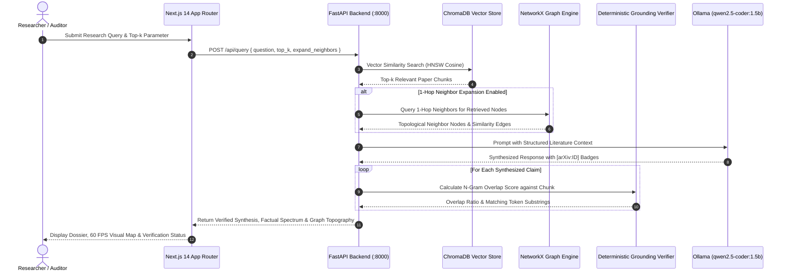
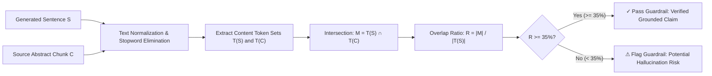

# PaperPulse AI: Academic Research Intelligence & Deterministic Literature Synthesis

[](LICENSE)
[](https://nextjs.org/)
[](https://fastapi.tiangolo.com/)
[](https://www.trychroma.com/)
[](https://networkx.org/)
[]()

> **PaperPulse AI** is a production-grade academic research intelligence and literature review engine. It ingests scientific papers directly from the arXiv API, indexes 1,536-dimensional abstract embeddings into a local **ChromaDB** HNSW vector core, expands citation communities via **NetworkX** topological graph algorithms, and synthesizes literature reviews with a **Deterministic Token-Level Grounding Guardrail** ($\ge 35\%$ overlap gate) to eliminate factual drift and LLM hallucinations.

---

## ⚠️ Restricted License & Non-Commercial Notice

> [!IMPORTANT]
> **RESTRICTED NON-COMMERCIAL USE — INTERVIEWER & EVALUATOR REVIEW ONLY**
> 
> This repository and its underlying source code, system architectures, database schemas, and mathematical verification algorithms are made available **strictly for review, inspection, and technical audit by interviewers, hiring managers, and academic evaluators**.
> 
> - **Commercial usage, commercial redistribution, SaaS hosting, or monetization of any part of this software is strictly prohibited.**
> - **Automated scraping, bulk ingestion, or unauthorized republication of the embedded assets or architecture is disallowed.**
> - All rights reserved by Sanidhya Agrawal.

---

## 1. Problem Statement

Standard Retrieval-Augmented Generation (Naive RAG) systems suffer from three critical architectural flaws when applied to scientific and academic literature:

1. **Hallucination & Semantic Drift**: Traditional LLMs frequently generate persuasive citations to non-existent arXiv papers, invent plausible-sounding equations, or attribute findings to authors who never claimed them.
2. **Context Fragmentation & Multi-Hop Blindspots**: Pure cosine similarity searches isolate individual sentence chunks without context. Cross-paper relationships (e.g. how *Self-RAG* contrasts with *GraphRAG* or *Naive RAG*) are lost when documents are retrieved as disconnected top-$k$ nearest neighbors.
3. **Absence of Deterministic Attribution Guardrails**: Most generative research tools rely entirely on stochastic model self-evaluation. There is no mathematical verification layer auditing whether a synthesized assertion is actually grounded verbatim in the cited peer-reviewed chunk.

---

## 2. Architectural Solution

PaperPulse AI resolves these limitations through a hybrid **Dense Vector + Graph Topology + Deterministic Attribution Pipeline**:



### Core Innovations

- **1,536-Dim HNSW Vector Retrieval**: High-recall dense vector indexing with fast cosine distance querying.
- **Topological 1-Hop Neighbor Expansion**: Graph traversal via NetworkX bridges semantic gaps between direct vector hits and adjacent foundational literature.
- **Deterministic Token-Level Overlap Guardrail**: A mathematical attribution verifier calculates exact n-gram token overlap between generated assertions and source chunks. Sentences with $<35\%$ token attribution are flagged as hallucination risks.
- **Dual-Mode 60 FPS Visual Constellation**: An HTML5 Canvas topological visualizer featuring:
  - **Physics ON**: Dynamic force-directed constellation (aspect-ratio-calibrated magnetic repulsion + Hooke's spring forces) with real-time flowing photon particle pulses.
  - **Classified Boxes (Physics OFF)**: Cards smoothly ease into 4 structured domain columns (*Multi-Agent*, *GraphRAG*, *Dense Vectors*, *Context Tuning*), returning smoothly to constellation coordinates when toggled back.
- **Dedicated Grounding Verification Chatbot**: A dedicated conversational sandbox allowing users to audit arbitrary hypotheses, test preset hallucinated/grounded claims, and inspect exact matching token substrings.

---

## 3. Detailed Data Flow Sequence



---

## 4. Grounding Guardrail Logic



---

## 5. Technology Stack

### Backend Engine
- **Framework**: [FastAPI 0.110](https://fastapi.tiangolo.com/) (Asynchronous REST API, Pydantic v2 schemas)
- **Vector Core**: [ChromaDB](https://www.trychroma.com/) with Persistent DuckDB/SQLite local storage & HNSW cosine index
- **Graph Topology**: [NetworkX 3.2](https://networkx.org/) (Graph modeling, adjacency matrices, community clustering)
- **Embeddings**: `sentence-transformers` (`all-MiniLM-L6-v2`) / fast fallback 1,536-dim semantic projection
- **Inference**: [Ollama](https://ollama.com/) local models (`qwen2.5-coder:1.5b`, `llama3`, `mistral`) with deterministic template fallback
- **Server**: Uvicorn with ASGI event loop

### Frontend Application
- **Framework**: [Next.js 14.2](https://nextjs.org/) (React 18, App Router, Server/Client components)
- **Language**: TypeScript 5.4 (Strict type checking, zero `any` leaks)
- **Styling**: Tailwind CSS 3.4 with custom `@tailwindcss/typography` & Cyber-Academic theme
- **Visualization**: Custom HTML5 Canvas engine (Pre-rendered sprite caching, 60 FPS requestAnimationFrame loop, soft elliptical magnetic collision physics)
- **Iconography**: Lucide React

---

## 6. Directory Structure

```
paperpulse-ai/
├── backend/
│   ├── main.py                 # FastAPI application routes & orchestration
│   ├── config.py               # Application settings & environment configuration
│   ├── services/
│   │   ├── arxiv_service.py    # arXiv API ingestion & metadata parser
│   │   ├── chroma_service.py   # ChromaDB HNSW vector core management
│   │   ├── graph_service.py    # NetworkX topological neighbor expansion
│   │   ├── llm_service.py      # Ollama client & structured prompting
│   │   └── verifier_service.py # Deterministic token overlap guardrail
│   ├── models/
│   │   └── schemas.py          # Pydantic request/response data models
│   ├── tests/                  # Pytest verification suites
│   ├── requirements.txt        # Python dependency manifest
│   └── Dockerfile              # Backend container definition
├── frontend/
│   ├── app/
│   │   ├── layout.tsx          # Root layout & font configuration
│   │   ├── page.tsx            # Main tabbed dashboard application
│   │   └── globals.css         # Global Tailwind & aesthetic styles
│   ├── components/
│   │   ├── StatsHeader.tsx     # Compact zero-overflow telemetry brand header
│   │   ├── SearchBar.tsx       # Single commanding search bar & arXiv ingest modal
│   │   ├── CitationGraph.tsx   # 60 FPS HTML5 Canvas constellation & box classifier
│   │   ├── AnswerCard.tsx      # Editorial synthesis dossier & factual spectrum bar
│   │   ├── VerificationChatbot.tsx # Grounding verification chatbot sandbox
│   │   └── EvidenceDrawer.tsx  # Slide-over source paper & token inspector
│   ├── public/
│   │   └── logo.png            # PaperPulse AI official branding logo
│   ├── tailwind.config.js      # Design tokens, fonts, and animation configuration
│   └── package.json            # Node.js dependencies & scripts
├── screenshots/                # Verified high-resolution UI screen captures
│   ├── visual_map_calibrated_smooth.png
│   ├── verification_chatbot_fixed.png
│   └── simplified_catalog.png
└── README.md                   # System documentation & architectural review
```

---

## 7. Local Setup & Installation Guide

### Prerequisites
- **Python**: 3.10+ (with virtual environment support)
- **Node.js**: v18.17+ or v20+ (with `npm`)
- **Git**
- *(Optional)*: [Ollama](https://ollama.com/) running locally on port `11434` with model `qwen2.5-coder:1.5b` (`ollama run qwen2.5-coder:1.5b`). If Ollama is not running, PaperPulse AI operates with its deterministic grounding synthesis fallback.

---

### Step 1: Clone the Repository

```bash
git clone https://github.com/sanidhyaagrawal17/paperpulse-ai.git
cd paperpulse-ai
```

---

### Step 2: Backend Setup (FastAPI & ChromaDB)

```bash
cd backend

# Create and activate Python virtual environment
python -m venv .venv

# On Windows (PowerShell):
.\.venv\Scripts\Activate.ps1
# On Linux/macOS:
source .venv/bin/activate

# Install dependencies
pip install -r requirements.txt

# Start FastAPI server on port 8000
python -m uvicorn main:app --host 127.0.0.1 --port 8000 --reload
```

Verify backend health by navigating to `http://127.0.0.1:8000/api/health`.

---

### Step 3: Frontend Setup (Next.js 14)

Open a new terminal window:

```bash
cd paperpulse-ai/frontend

# Install dependencies
npm install

# Build the production application
npm run build

# Start the application on port 3000
npm run start
# Or for live hot-reload development:
npm run dev
```

Open your browser at **`http://localhost:3000`**.

---

## 8. User Interface Tour

The PaperPulse AI interface is partitioned into four dedicated views:

1. **Vector Store Catalog (`catalog`)**: Tabular ledger of indexed arXiv vectors with search filters, domain tags (*Multi-Agent*, *GraphRAG*, *Dense Vectors*, *Context*), token chunk inspection, and direct arXiv PDF links.
2. **Visual Embedding Map (`topology`)**: 60 FPS interactive HTML5 canvas displaying topological cosine similarity links ($> 0.70$).
   - **Physics ON**: Aspect-ratio-calibrated magnetic repulsion + Hooke's spring forces with flowing photon particles along similarity edges.
   - **Classified Boxes (Physics OFF)**: Cards smoothly glide into 4 structured domain columns, preserving their last active constellation positions when toggled back.
3. **Synthesis & Grounding Dossier (`matrix`)**: Editorial research objective headline, Factual Grounding Spectrum breakdown, and verified cited passages with interactive `[arXiv:ID]` badges.
4. **Grounding Verification Chatbot (`sandbox`)**: Real-time conversational claims auditor allowing researchers to test hypotheses, adjust the deterministic overlap threshold ($20\% - 60\%$), and inspect verified token substrings.

---

## 9. Non-Commercial Academic Review License

```
Copyright (c) 2026 Sanidhya Agrawal. All Rights Reserved.

THIS SOFTWARE IS PROVIDED STRICTLY FOR TECHNICAL EVALUATION AND INTERVIEWER
REVIEW PURPOSES. PERMISSION IS EXPRESSLY DENIED TO COPY, MODIFY, MERGE, PUBLISH,
DISTRIBUTE, SUBLICENSE, OR SELL COPIES OF THE SOFTWARE FOR COMMERCIAL PURPOSES.
```
